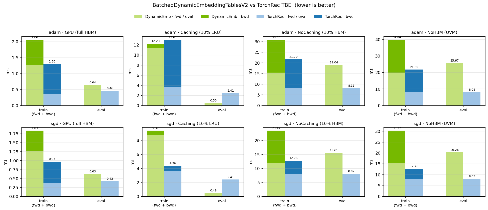
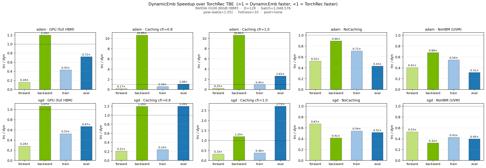

# Dynamic Embedding Benchmark

## Overview

This folder contains benchmarks about dynamicemb.

## 1.Benchmark EmbeddingCollection

In this benchmark, we provide a simple performance test for dynamic embedding using 8 GPUs. The test utilizes the embedding table from DLRM and performs embedding table fusion to create a large embedding table, followed by lookups for 26 features.

### How to run

```bash
bash ./benchmark/benchmark_embedding_collection.sh <use_index_dedup> <use_dynamic_embedding> <batch_size>
```

#### Parameters

- `<use_index_dedup>`: A boolean flag to enable or disable index deduplication before data distribution.
  - **True**: Enables index deduplication, reducing communication overhead.
  - **False**: Disables index deduplication.
  - **Default**: True.

- `<use_dynamic_embedding>`: A boolean flag to enable or disable the use of dynamic embedding tables.
  - **True**: Enables dynamic embedding tables.
  - **False**: Uses static embedding tables from TorchREC.
  - **Default**: True.

- `<batch_size>`: The global batch size for processing during the benchmark.
  - **Default**: 65536.

### Test Results

In this benchmark, we primarily focus on the performance of embedding collection and deduplication. The tests were conducted on a single node with 8 H100 GPUs connected via NVSwitch. Below are the performance results:

| Configuration               | TorchREC Raw Table (ms) | Dynamic Embedding Table (ms) |
|-----------------------------|-------------------------|-------------------------------|
| Open Dedup, Batch Size 65536 | 14.88                   | 21.56                         |
| Close Dedup, Batch Size 65536 | 23.99                   | 28.47                         |

These results indicate the time taken to perform the embedding collection and deduplication operations under the specified configuration.

During the embedding lookup process, dynamic embedding incurs some performance overhead compared to TorchREC's raw table. However, these overheads diminish when considered within the context of the entire end-to-end model.

## 2.Benchmark BatchedDynamicEmbeddingTables

This benchmark measures forward / backward / evaluation overhead of
`BatchedDynamicEmbeddingTablesV2` against the TorchRec/FBGEMM
`SplitTableBatchedEmbeddingBagsCodegen` baseline on a single GPU.

It is structured as a pytest suite (`benchmark_batched_dynamicemb_tables.py`)
wrapped by a thin shell launcher (`benchmark_batched_dynamicemb_tables.sh`).
All extra flags after the shell script are forwarded to pytest, so you can
use pytest's `-k`, `-x`, `--co`, etc. to select / inspect tests.

### Test suites

Four suites parametrize over `(batch_size, optimizer, pooling_mode)`:

| Suite           | gpu_ratio | caching | Notes                              |
| --------------- | --------- | ------- | ---------------------------------- |
| `TestGpu`       | 1.0       | False   | Full table in HBM                  |
| `TestCaching`   | 0.1       | True    | 10% HBM as LRU cache               |
| `TestNoCaching` | 0.1       | False   | 10% HBM in HybridStorage           |
| `TestNoHbm`     | 0.0       | False   | Pure UVM                           |

Default per-config knobs: `num_iterations=100`, `embedding_dim=128`,
`feature_distribution="pow-law"` with `alpha=1.05`, `emb_precision=fp32`,
Adam (or SGD) with `learning_rate=0.1`, `eps=1e-8`.

### Run everything

```bash
bash ./benchmark/benchmark_batched_dynamicemb_tables.sh
```

Output goes to stdout and a per-config JSON entry is appended to
`benchmark_results.json` (override via `BENCHMARK_RESULTS_FILE=...`).

### Run a subset

The shell script forwards `"$@"` to pytest, so any pytest selector works:

```bash
# Only the full-HBM suite
bash ./benchmark/benchmark_batched_dynamicemb_tables.sh -k TestGpu

# Only Adam configs (any suite)
bash ./benchmark/benchmark_batched_dynamicemb_tables.sh -k adam

# Combine
bash ./benchmark/benchmark_batched_dynamicemb_tables.sh -k "TestCaching and adam"

# List configs without running anything
bash ./benchmark/benchmark_batched_dynamicemb_tables.sh --co
```

Config labels look like
`T1_totalB1048576_D128_adam_caching_pool=none_cap=256M`; you can match any
substring of that with `-k`.

### Correctness mode

Correctness mode compares the per-iter forward output of DynamicEmb
against the TorchRec/FBGEMM TBE baseline.  It:

1. Restricts the sparse-feature sampler to `[0, cap/2)` for each table.
2. Mirrors TorchRec's `[0, cap/2)` weight slice into DynamicEmb so every
   lookup hits a key with identical initial values on both backends.
3. Runs the timing loop (`benchmark_train_eval`) with `check_forward=True`
   so every train / eval iter asserts `torch.allclose` with a
   precision-aware tolerance (`atol=1e-4, rtol=1e-3` for fp32).

Two ways to enable it:

```bash
# CLI override: force-enable on every parametrized config
bash ./benchmark/benchmark_batched_dynamicemb_tables.sh --correctness

# Per-config: set `correctness=True` on the BenchmarkConfig in
# _gpu_configs / _caching_configs / etc.
```

Correctness is automatically disabled (with a `UserWarning`) when any
`--profile` mode is set, because profiling captures workloads rather than
validating them.

### Nsight Systems (nsys) profiling

`--profile nsys` switches the run to a dedicated nsys-friendly path:
`run_reporting_loop` runs as untimed warmup, then `benchmark_with_nsys`
wraps the actual sampled iterations in a `cudaProfilerStart` /
`cudaProfilerStop` window.  The benchmark itself only annotates NVTX
ranges; the actual capture happens externally via `nsys profile`.

Launch under nsys with `--capture-range=cudaProfilerApi
--capture-range-end=stop` so the trace contains only the marked window:

```bash
nsys profile \
    -o trace_dyn -f true \
    --capture-range=cudaProfilerApi --capture-range-end=stop \
    --trace=cuda,nvtx,osrt \
    --target-processes=all \
    bash ./benchmark/benchmark_batched_dynamicemb_tables.sh \
        --profile nsys -k "TestGpu and adam"
```

NVTX layout inside the capture window:
```
<cfg.label()>                          # e.g. T1_totalB1048576_D128_adam_gpu_...
└─ nsys_iter_0                         # per-iter
   ├─ dyn → forward / backward
   └─ trc → forward / backward
└─ nsys_iter_1
└─ ...
```

Browse the trace with `nsys-ui` (locally) or summarize on the cluster:

```bash
nsys stats --report cuda_gpu_kern_sum trace_dyn.nsys-rep | head -30
nsys stats --report nvtx_pushpop_sum  trace_dyn.nsys-rep | head -30
```

Other profile modes:

| `--profile` value | What it does                                                          |
| ----------------- | --------------------------------------------------------------------- |
| (omitted)         | Normal timing path; reports avg fwd/bwd/train/eval (ms) per config.    |
| `torch`           | Runs each backend under `torch.profiler`; exports Chrome trace + bandwidth report. |
| `nsys`            | NVTX-annotated profile path described above.                          |
| `ncu-gen`         | Prints the matching `ncu` command for the config and exits.           |
| `ncu-run`         | Runs a single fwd+bwd inside `cudaProfilerStart/Stop` for `ncu` wrap. |

### Cache footprint sizing (TestCaching)

`TestCaching` is parametrized by `cache_footprint_ratio` (currently
`[0.5, 0.8]`).  At runtime the harness:

1. Generates the full sparse-feature stream before any table is built.
2. Counts distinct keys touched per table across all iterations -- the
   workload's true HBM footprint.
3. Resizes the cache so it holds
   `footprint × cache_footprint_ratio` rows per table
   (DynamicEmb `local_hbm_for_values`, FBGEMM `cache_load_factor`).

This means TestCaching emits one config per ratio in the suite, with
labels like `..._caching_..._cfr=0.5` / `..._cfr=0.8`.  The other three
suites (`TestGpu`, `TestNoCaching`, `TestNoHbm`) leave
`cache_footprint_ratio=None` and keep their construction-time
`hbm_for_embeddings` / `gpu_ratio`.

Cache state from the warmup (`run_reporting_loop`) is **kept** for the
subsequent timed `benchmark_train_eval` — only the hit-rate recorder is
disabled.  The timed numbers therefore measure steady-state cache
behavior, not a cold start.

### Plotting results

`benchmark_results.json` produced above is visualized with
`plot_benchmark_results.py`.  Figures are written into a single output
directory (default `./plots/`) as **one figure** (`benchmark_bdet_plot.png`)
+ optionally one speedup figure (`benchmark_bdet_speedup_plot.png`).  The
caching column auto-fans-out into one panel per `cache_footprint_ratio`
present in the JSON, so cfr=0.5 and cfr=0.8 sit side-by-side in the same
image (the figure width scales with column count).

```bash
# Main figure into ./plots/benchmark_bdet_plot.png
python plot_benchmark_results.py

# Main + trc/dyn speedup
python plot_benchmark_results.py --speedup

# Different output directory / results file
python plot_benchmark_results.py \
    --results /path/to/results.json \
    --out-dir /tmp/bdet_plots --speedup

# Log y-axis (one suite dominates the range)
python plot_benchmark_results.py --log

# Hide bar value labels
python plot_benchmark_results.py --no-values
```

Each figure carries a two-line subtitle auto-derived from the result
dict:

```
NVIDIA H100 80GB HBM3  ·  D=128  ·  batch=1,048,576
pow-law(α=1.05)  ·  hotness=10  ·  pool=none
```

`cache_footprint_ratio` is intentionally not in the subtitle — it shows
up in the per-panel titles instead (`Caching · cfr=0.5`, `Caching · cfr=0.8`).
Fields populated by `run_single_benchmark`: `gpu_name`, `embedding_dim`,
`batch_size`/`num_tables`, `feature_distribution`, `alpha`, `max_hotness`,
`pooling_mode`, `cache_footprint_ratio`.  Any field missing from a legacy
JSON is silently skipped.

Layout:
- Main figure: 2 rows (optimizer) × N cols (`GPU`, one per caching
  ratio, `NoCaching`, `NoHBM`).  Each panel shows a stacked
  `train (fwd + bwd)` bar plus a separate `eval` bar for DynamicEmb
  vs TorchRec; every panel auto-scales independently.
- Speedup figure (with `--speedup`): same row × col layout, four bars
  per panel (`fwd / bwd / train / eval`) showing `TorchRec / DynamicEmb`.
  A dashed `1.0×` line marks parity; bars above → DynamicEmb is the
  faster backend, below → TorchRec is.

### Test Results

The figures below were collected on **NVIDIA H100 80GB HBM3** (single GPU)
with `pow-law(alpha=1.05)` index distribution.

Run configuration:
- hardware: NVIDIA H100 80GB HBM3 (single GPU)
- embedding_dtype: float32
- embedding_dim: 128
- batch_size: 1,048,576 (single table)
- cache_algorithm: lru
- gpu_ratio: 1.0 (`TestGpu`) / footprint × `cache_footprint_ratio`
  (`TestCaching`) / 0.1 (`TestNoCaching`) / 0.0 (`TestNoHbm`)
- capacity: 16M when gpu_ratio=1.0 (`TestGpu`, sized to fit dual backends in 80 GB), 256M otherwise
- optimizers: adam (`eps=1e-8`) and sgd
- num_iterations: 100

Latency by suite (DynamicEmb vs TorchRec TBE, lower is better):



TorchRec / DynamicEmb speedup ratio (>1× → DynamicEmb faster, <1× → TorchRec faster):


