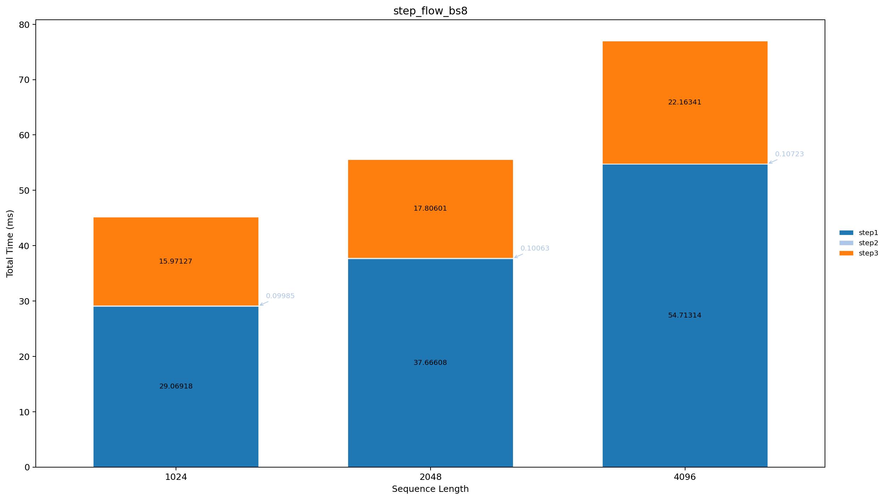
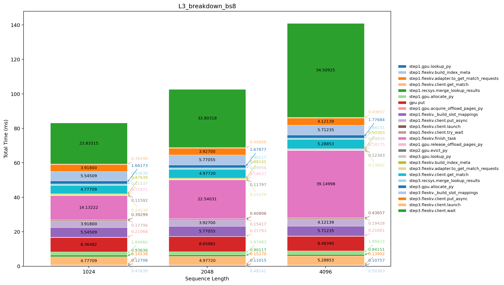
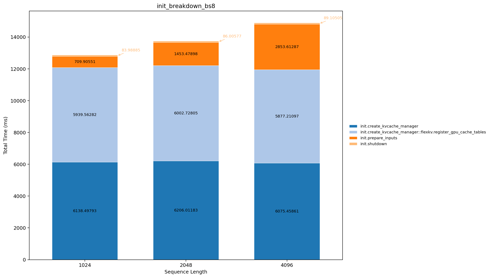
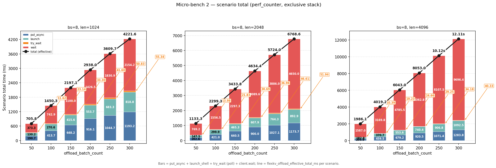

# Recsys KVCache Manager — Performance Analysis

---

## Test Environment


| Item       | Value                                               |
| ---------- | --------------------------------------------------- |
| GPU        | **NVIDIA L20**                                      |
| Node       | **a1u1g-rome-0055**                                 |
| KV tensors | `bf16`, shape `(num_layers=3, max_seq_len, 4, 128)` |


---

## Experiment Overview


| Name              | Directory      | What is measured                                                                                                                                                                                        |
| ----------------- | -------------- | ------------------------------------------------------------------------------------------------------------------------------------------------------------------------------------------------------- |
| **Micro-bench 1** | `breakdown_1/` | One full **3-step** pipeline + **L1–L3** NVTX breakdown (+ init); includes a **single** `offload_try_wait` sub-experiment                                                                               |
| **Micro-bench 2** | `breakdown_2/` | **Repeated offload** only (`launch` + `try_wait` loop); sweep `offload_batch_count`, `batch_size`, and `sequence_length`; timing = `perf_counter` **hooks** (NVTX tags optional, **not** nsys-exported) |


```text
[Step1] input (1024 x 8) → lookup → allocate(+gpu.put) → offload_launch(+put_async) → offload_wait
[Step2] evict_gpu
[Step3] input (the same, 1024 x 8 ) → lookup → allocate → onboard_launch → onboard_wait
```

---

## Micro-bench 1: 3-Step Pipeline + Three-Level Breakdown

### 1.1 Scripts

- **main:**`breakdown_1/test_flexkv_profile_fine.py`;
- one-shot: `breakdown_1/run_full_profiling.sh`.

### 1.2 Configuration


| Parameter                         | Value                  | Notes                                             |
| --------------------------------- | ---------------------- | ------------------------------------------------- |
| `batch_size`                      | **8**                  | Requests per step                                 |
| `len_per_seq` / `sequence_length` | **1024 / 2048 / 4096** | Active tokens per sequence; `max_seq_len` matches |
| `repeat`                          | **1**                  | Cold start — one 3-step pass                      |
| `num_layers`                      | **3**                  | Matches test KV tensor layers                     |


### 1.3 Three-step pipeline (L3 breakdown)

**Step 1 — Offload path (GPU → Host)**


| Sub-stage              | Main calls                                                                                                                          | Role                                           |
| ---------------------- | ----------------------------------------------------------------------------------------------------------------------------------- | ---------------------------------------------- |
| `step1.lookup`         | `gpu.lookup` → `flexkv.build_index_meta` → `flexkv.lookup_kvcache` (`adapter` + `client.get_match`) → `recsys.merge_lookup_results` | Lookup existing KV hits                        |
| `step1.allocate`       | `allocate_kvcache` → `gpu.put` (per-layer write into GPU cache)                                                                     | Allocate GPU pages and fill them               |
| `step1.offload_launch` | `gpu.acquire_offload_pages` → `flexkv._build_slot_mappings` → `flexkv.client.put_async` (× batch)                                   | Submit async offload to FlexKV host            |
| `step1.offload_wait`   | `flexkv.client.try_wait` + `flexkv.finish_task` (i.e.,`client.wait`) → `gpu.release_offload_pages`                                  | Poll until offload completes and release pages |


**Step 2 — Evict**


| Sub-stage         | Main calls  | Role                    |
| ----------------- | ----------- | ----------------------- |
| `step2.evict_gpu` | `gpu.evict` | Reclaim GPU cache pages |


**Step 3 — Onboard path (Host → GPU)**


| Sub-stage              | Main calls                                             | Role                        |
| ---------------------- | ------------------------------------------------------ | --------------------------- |
| `step3.lookup`         | Same as step1.lookup                                   | Re-lookup before onboard    |
| `step3.allocate`       | `gpu.allocate`                                         | Target pages for onboard    |
| `step3.onboard_launch` | `flexkv._build_slot_mappings` → `flexkv.client.launch` | Submit onboard              |
| `step3.onboard_wait`   | `flexkv.client.wait` (under `onboard_kvcache_wait`)    | Wait for onboard completion |


### 1.4 Three-level breakdown (+ init)


| Level  | Name              | Time represented                                                                                                              | Artifacts                                       |
| ------ | ----------------- | ----------------------------------------------------------------------------------------------------------------------------- | ----------------------------------------------- |
| **L1** | Step totals       | Accumulated ms for top-level `step1` / `step2` / `step3` NVTX                                                                 | `step_flow_bs8.csv` → `step_flow_bs8.png`       |
| **L2** | Step-Op           | Nine fixed ops under L1 (lookup, allocate, offload_launch, offload_wait, evict, …)                                            | `step_op_flow_bs8.csv` → `step_op_flow_bs8.png` |
| **L3** | Function timeline | Per L2 op: `stepX.gpu.`* / `stepX.flexkv.`* / `stepX.recsys.`* in **real call order**; includes `gpu.put` (NVTX `gpu.put_py`) | `L3_breakdown_bs8.csv` → `L3_breakdown_bs8.png` |


---

### 1.5 L1: Step totals (ms)


| `sequence_length` | step1 | step2 | step3 | **Sum**   |
| ----------------- | ----- | ----- | ----- | --------- |
| 1024              | 29.07 | 0.10  | 15.97 | **45.14** |
| 2048              | 37.67 | 0.10  | 17.81 | **55.57** |
| 4096              | 54.71 | 0.11  | 22.16 | **76.98** |




**Figure 1: L1 — accumulated NVTX time per step (`batch_size=8`).** Step1 (offload path) dominates end-to-end time and grows ~1.9× from 1024→4096 (29.1→54.7 ms); step2 evict is negligible (~0.1 ms); step3 onboard is second but smaller than step1 (16–22 ms). Total cold 3-step pass: **45–77 ms** depending on `sequence_length`.

---

### 1.6 L2: Step-Op (nine ops, ms)


| op                     | 1024      | 2048      | 4096      |
| ---------------------- | --------- | --------- | --------- |
| step1.lookup           | 3.99      | 3.96      | 4.17      |
| step1.allocate         | 1.06      | 1.09      | 1.16      |
| step1.offload_launch   | 9.45      | 9.69      | 9.77      |
| **step1.offload_wait** | **14.57** | **22.93** | **39.60** |
| step2.evict_gpu        | 0.10      | 0.10      | 0.11      |
| step3.lookup           | 3.37      | 3.55      | 3.62      |
| step3.allocate         | 0.47      | 0.46      | 0.47      |
| step3.onboard_launch   | 2.30      | 2.43      | 2.59      |
| step3.onboard_wait     | 9.83      | 11.36     | 15.48     |


**Figure 2: L2 — nine fixed step_ops.** Within step1, **`offload_wait`** is the largest op (14.6→39.6 ms) and drives L1 growth; `offload_launch` stays ~9–10 ms; lookup ~4.0–4.2 ms. Step3 **`onboard_wait`** rises with length (9.8→15.5 ms) but stays below step1 wait.

---

### 1.7 L3: Function-level timeline (ms, `batch_size=8`)

**step1.allocate (incl. per-layer put)**


| Call            | 1024     | 2048     | 4096     |
| --------------- | -------- | -------- | -------- |
| gpu.allocate_py | 1.85     | 1.87     | 1.99     |
| **gpu.put**     | **8.36** | **8.66** | **8.48** |


**step1.lookup**


| Call                        | 1024 | 2048 | 4096 |
| --------------------------- | ---- | ---- | ---- |
| gpu.lookup_py               | 0.13 | 0.11 | 0.11 |
| flexkv.build_index_meta     | 0.48 | 0.48 | 0.50 |
| flexkv.client.get_match     | 4.78 | 4.98 | 5.29 |
| recsys.merge_lookup_results | 0.94 | 0.90 | 0.84 |


**step1.offload_wait (dominant)**


| Call                                     | 1024  | 2048  | 4096  |
| ---------------------------------------- | ----- | ----- | ----- |
| flexkv.client.try_wait                   | 0.18  | 0.15  | 0.19  |
| flexkv.finish_task (incl. `client.wait`) | 14.13 | 22.54 | 39.15 |
| gpu.release_offload_pages_py             | 0.22  | 0.19  | 0.18  |




**Figure 3: L3 — per-op function timeline (call order).** Under `offload_wait`, **`flexkv.finish_task` / `client.wait`** (~14–39 ms) accounts for almost all step1 wait; `client.try_wait` poll leaves are ~0.2 ms (not the same as one `offload_try_wait()` wall — see §1.10). **`gpu.put`** (~8.4–8.7 ms) is nearly flat vs `sequence_length`; lookup cost is mostly **`flexkv.client.get_match`** (~4.8–5.3 ms).

---

### 1.8 Initialization (separate, ms)


| `sequence_length` | create_kvcache_manager | register_gpu_cache_tables | prepare_inputs | shutdown |
| ----------------- | ---------------------- | ------------------------- | -------------- | -------- |
| 1024              | 6138.5                 | 5939.6                    | 709.9          | 84.0     |
| 2048              | 6206.0                 | 6002.7                    | 1453.5         | 86.0     |
| 4096              | 6075.5                 | 5877.2                    | 2853.6         | 89.1     |




**Figure 4: Init phase (excluded from L1–L3 pipeline).** One-time **`create_kvcache_manager` + `register_gpu_cache_tables`** ~12.0 s dominates; **`prepare_inputs`** grows with `max_seq_len` (0.7→2.9 s). Not on the steady-state hot path after warmup.

---

### 1.10 Single `offload_try_wait` sub-experiment

**Goal:** wall time of **one Python call** to `KVCacheManager.offload_try_wait()` (NVTX `step1.offload_try_wait_once`). This is **not** the L3 `flexkv.client.try_wait` leaf total, and **not** the sum of many `offload_try_wait()` calls.

**Three names (do not mix):**


| Name                     | Level                                                                                                                                          | Meaning                                                                        |
| ------------------------ | ---------------------------------------------------------------------------------------------------------------------------------------------- | ------------------------------------------------------------------------------ |
| `step1.offload_wait`     | L2 pipeline step | `while` loop: call `offload_try_wait()` until `ongoing_offload_tasks` is empty |
| `offload_try_wait()`     | One host API call                                                                                                                              | Sub-exp metric; one poll + finish + release per call (typical @bs8)            |
| `flexkv.client.try_wait` | FlexKV hook leaf                                                                                                                               | Non-blocking status poll **inside** `offload_kvcache_wait` (~0.1–0.2 ms)       |


**Call hierarchy**

```text
step1.offload_wait                         ← L2: whole step (may call offload_try_wait N times)
  └ offload_try_wait()  × N              ← sub-exp: ONE call only (N=1 typical @bs8, see nsys Count)
       ├ offload_kvcache_wait → client.try_wait()   (~0.1 ms poll)
       ├ finish_task → client.wait(completely=True)  (~14–39 ms, dominant)
       └ release_offload_pages_py                  (~0.1 ms)
```

At `batch_size=8`, main-pipeline nsys often shows `recsys.offload_try_wait_loop` **Count=1** (one Python call drains the batch). L3 `client.try_wait` (~0.2 ms in the main sweep) is the **poll hook inside that call**, not the wall time of `offload_try_wait()` itself.

**Script:** `breakdown_1/single_try_wait_profiling.py` — same preamble as step1, then **one** `offload_try_wait()`, then `os._exit(0)` (no extra drain / `shutdown`; can hang).

**Results** (`batch_size=8`, `flexkv_fine`):


| `len_per_seq` | One `offload_try_wait()` wall (ms) | `client.try_wait` inside call | `client.wait` inside call |
| ------------- | ---------------------------------- | ----------------------------- | ------------------------- |
| 1024          | **14.57**                          | 0.18                          | 14.13                     |
| 2048          | **22.93**                          | 0.15                          | 22.54                     |
| 4096          | **39.60**                          | 0.19                          | 39.15                     |


**Reproduce** (`breakdown_1/run.md` §5–6):

```bash
cd breakdown_1
OUT=profiler_result/single_try_wait
mkdir -p "${OUT}/rep" "${OUT}/csv"
for LEN in 1024 2048 4096; do
  nsys profile -t cuda,nvtx,osrt --sample=none --cuda-memory-usage=true --force-overwrite true \
    -o "${OUT}/rep/len${LEN}_bs8_single_try_wait" \
    python3 single_try_wait_profiling.py \
      --base-profile-mode flexkv_fine \
      --len-per-seq "${LEN}" --batch-size 8 --max-seq-len "${LEN}"
  nsys stats --report nvtx_pushpop_sum --format csv \
    --output "${OUT}/csv/len${LEN}_bs8_single_try_wait" \
    "${OUT}/rep/len${LEN}_bs8_single_try_wait.nsys-rep"
done
```

---

### 1.11 Micro-bench 1 conclusions

1. **Bottleneck:** `step1.offload_wait`, ~2.7× from 14.6 ms → 39.6 ms as `sequence_length` grows.
2. **step2 evict** negligible; **step3 onboard_wait** second.
3. Lookup dominated by `flexkv.client.get_match`; GPU lookup/allocate sub-ms to ~1 ms.
4. Optimize FlexKV offload backend wait first; use `offload_try_wait_once` to compare poll-policy changes.

---

## Micro-bench 2: Repeated Offload

Stress-test **many consecutive FlexKV offloads** (new `user_id` each iteration). Numbers below are from **`time.perf_counter()`** — see `breakdown_2/profiler_python_result/`. Optional Nsight cross-check: `breakdown_2/profiler_result_nsys/` (same NVTX labels; phase times usually within a few percent — inspect CSV/rep yourself).

### 2.1 Goals

**In scope per iteration:** `lookup` (minimal) → `allocate` → `gpu.put` → `offload_launch` → `offload_try_wait` until that round’s tasks clear (`while ongoing_offload_tasks` in `run_one_offload()`). **Not** the full 3-step pipeline from Micro-bench 1 and **not** the single-call sub-exp in §1.10.

### 2.2 Configuration


| Parameter                     | Value                                      |
| ----------------------------- | ------------------------------------------ |
| `batch_size`                  | 8, 32, 64, 128                             |
| `len_per_seq` / `max_seq_len` | 1024, 2048, 4096                           |
| `offload_batch_count`         | 50, 100, 150, 200, 250, 300                |
| `host_capacity_scale`         | **8** (avoid early host fill on long runs) |
| `warmup_iterations`           | 1 (excluded from hook averages below)      |


### 2.3 Results (`profiler_python_result`, `perf_counter`)

#### Comparison @ `bs=8`, `len=1024`


| N   | `total_offload_time_ms` | `average_wall_offload_ms` | `average_effective_offload_ms` |
| --- | ----------------------- | ------------------------- | ------------------------------ |
| 50  | 1,077                   | 21.5                      | 14.4                           |
| 100 | 1,950                   | 19.5                      | 14.7                           |
| 300 | 5,469                   | 18.2                      | 14.1                           |


**Analysis:** `average_effective_offload_ms` stays ~14 ms while N grows → FlexKV offload hooks do **not** slow down with repeat count. `average_wall_offload_ms` drifts 21.5→18.2 ms (warmup amortization + fixed per-scenario overhead). For capacity planning use **`total_offload_time_ms`**; for backend tuning use **`average_effective_offload_ms`** (and the stack breakdown).

#### vs `len_per_seq` (`bs=8`, N=50 scenario)


| `len` | `average_effective_offload_ms` | `client.wait` | `put_async` |
| ----- | ------------------------------ | ------------- | ----------- |
| 1024  | 14.4                           | 7.6           | 3.9         |
| 2048  | 23.1                           | 15.7          | 4.1         |
| 4096  | 40.5                           | 32.4          | 4.2         |


#### vs `batch_size` (`len=1024`, N=50)


| `batch_size` | `average_effective_offload_ms` | `client.wait` | `put_async` |
| ------------ | ------------------------------ | ------------- | ----------- |
| 8            | 14.4                           | 7.6           | 3.9         |
| 32           | 49.5                           | 18.2          | 17.1        |
| 64           | 88.0                           | 40.9          | 28.6        |
| 128          | 173.6                          | 78.7          | 57.5        |


Throughput scales roughly linearly with batch size (dominated by `put_async` + `client.wait`).

### 2.4 Figure



**Figure 7: Micro-bench 2 — scenario totals (`perf_counter`), `bs=8`, len 1024 / 2048 / 4096.** Each panel: x-axis = `offload_batch_count`; stacked bars = exclusive `put_async` + `launch_shell` + poll + `client.wait`; black line = scenario effective FlexKV total. **Read:** red **`client.wait`** grows with `len_per_seq` (dominant at 4096); `put_async` ~flat across lengths; effective total scales ~linearly with length (14→41 ms/offload) while **repeat count does not bend the line** — consistent with §2.3 “no degradation.”

### 2.5 Reproduce

```bash
cd breakdown_2

# Sweep + per-file plots + 1×3 panel (CSV under profiler_python_result/)
OUT_ROOT=./profiler_python_result bash run_sweep_offload.sh

# Or panel only (after CSVs exist):
python3 -m venv .plot-venv && .plot-venv/bin/pip install numpy matplotlib
.plot-venv/bin/python3 plot_offload_scenario_panel.py \
  --summary-root profiler_python_result/summarization \
  --origin-root profiler_python_result/origin_data \
  --output profiler_python_result/plot/microbench2_bs8_len_panel.png

# Optional nsys cross-check (not used in tables above):
bash run_sweep_offload_nsys.sh
#   → profiler_result_nsys/csv/offload_bs*_len*_nvtx_pushpop_sum.csv
```

### 2.7 Conclusions

1. **No degradation** over 50–300 offloads @ `bs=8`, `len=1024` (`average_effective_offload_ms` ~14 ms; §2.3).
2. **Length:** `client.wait` grows ~3× from 1024→4096; `put_async` ~flat.
3. **Batch:** `average_effective_offload_ms` scales ~linearly with `batch_size` at `len=1024`.

---

