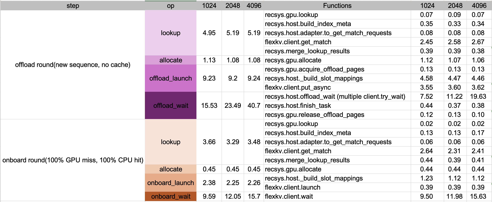
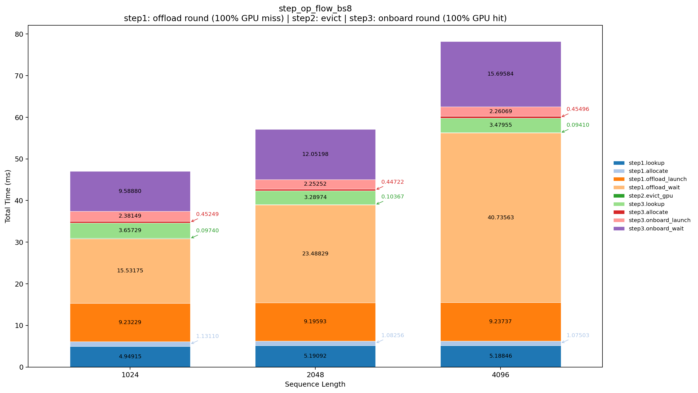

# Recsys KVCache Manager — Performance Analysis

---

## Test Environment


| Item       | Value                                               |
| ---------- | --------------------------------------------------- |
| GPU        | **NVIDIA L20**                                      |
| Node       | **a1u1g-rome-0055**                                 |
| KV tensors | `bf16`, shape `(num_layers=3, max_seq_len, 4, 128)` |


---

## Micro-bench 1: 3-Step Pipeline + Three-Level Breakdown

### 1.1 Configuration


| Parameter                         | Value                  |
| --------------------------------- | ---------------------- |
| `batch_size`                      | **8**                  |
| `len_per_seq` / `sequence_length` | **1024 / 2048 / 4096** |


```text
[Step1: offload round（new sequence, no cache）] input (1024 x 8) → lookup → allocate(+gpu.put) → offload_launch(+put_async) → offload_wait
[Step2] evict_gpu
[Step3: onboard round (100% GPU miss, 100% CPU hit)] input (the same, 1024 x 8 ) → lookup → allocate → onboard_launch → onboard_wait
```



### 1.2 step-op results

<table>
  <thead>
    <tr>
      <th>step</th>
      <th>op</th>
      <th>1024</th>
      <th>2048</th>
      <th>4096</th>
    </tr>
  </thead>
  <tbody>
    <tr>
      <td rowspan="4">offload round（new sequence, no cache）</td>
      <td>lookup</td>
      <td>4.949</td>
      <td>5.191</td>
      <td>5.188</td>
    </tr>
    <tr>
      <td>allocate</td>
      <td>1.131</td>
      <td>1.083</td>
      <td>1.075</td>
    </tr>
    <tr>
      <td>offload_launch</td>
      <td>9.232</td>
      <td>9.196</td>
      <td>9.237</td>
    </tr>
    <tr>
      <td><strong>offload_wait</strong></td>
      <td><strong>15.532</strong></td>
      <td><strong>23.488</strong></td>
      <td><strong>40.736</strong></td>
    </tr>
    <tr>
      <td rowspan="4">onboard round（100% GPU miss, 100% CPU hit）</td>
      <td>lookup</td>
      <td>3.657</td>
      <td>3.290</td>
      <td>3.480</td>
    </tr>
    <tr>
      <td>allocate</td>
      <td>0.452</td>
      <td>0.447</td>
      <td>0.455</td>
    </tr>
    <tr>
      <td>onboard_launch</td>
      <td>2.381</td>
      <td>2.253</td>
      <td>2.261</td>
    </tr>
    <tr>
      <td>onboard_wait</td>
      <td>9.589</td>
      <td>12.052</td>
      <td>15.696</td>
    </tr>
  </tbody>
</table>




### 1.3 L3 key-call breakdown
<table>
  <thead>
    <tr>
      <th>step</th>
      <th>op</th>
      <th>1024</th>
      <th>2048</th>
      <th>4096</th>
    </tr>
  </thead>
  <tbody>
    <tr>
      <td rowspan="12">offload round（new sequence, no cache）</td>
      <td><code>gpu.lookup_py</code></td>
      <td>0.066</td>
      <td>0.086</td>
      <td>0.068</td>
    </tr>
    <tr>
      <td><code>flexkv.build_index_meta</code></td>
      <td>0.347</td>
      <td>0.330</td>
      <td>0.339</td>
    </tr>
    <tr>
      <td><code>flexkv.adapter.to_get_match_requests</code></td>
      <td>0.078</td>
      <td>0.079</td>
      <td>0.083</td>
    </tr>
    <tr>
      <td><code>flexkv.client.get_match</code></td>
      <td>2.455</td>
      <td>2.581</td>
      <td>2.666</td>
    </tr>
    <tr>
      <td><code>recsys.merge_lookup_results</code></td>
      <td>0.386</td>
      <td>0.390</td>
      <td>0.384</td>
    </tr>
    <tr>
      <td><code>gpu.allocate_py</code></td>
      <td>1.118</td>
      <td>1.068</td>
      <td>1.062</td>
    </tr>
    <tr>
      <td><code>gpu.acquire_offload_pages_py</code></td>
      <td>0.127</td>
      <td>0.127</td>
      <td>0.131</td>
    </tr>
    <tr>
      <td><code>flexkv._build_slot_mappings</code></td>
      <td>4.577</td>
      <td>4.466</td>
      <td>4.464</td>
    </tr>
    <tr>
      <td><code>flexkv.client.put_async</code></td>
      <td>3.553</td>
      <td>3.595</td>
      <td>3.616</td>
    </tr>
    <tr>
      <td><code>flexkv.client.try_wait</code></td>
      <td>7.518</td>
      <td>11.224</td>
      <td>19.632</td>
    </tr>
    <tr>
      <td><code>flexkv.finish_task</code></td>
      <td>0.443</td>
      <td>0.367</td>
      <td>0.380</td>
    </tr>
    <tr>
      <td><code>gpu.release_offload_pages_py</code></td>
      <td>0.120</td>
      <td>0.127</td>
      <td>0.096</td>
    </tr>
    <tr>
      <td rowspan="9">onboard round（100% GPU miss, 100% CPU hit）</td>
      <td><code>gpu.lookup_py</code></td>
      <td>0.022</td>
      <td>0.022</td>
      <td>0.022</td>
    </tr>
    <tr>
      <td><code>flexkv.build_index_meta</code></td>
      <td>0.126</td>
      <td>0.128</td>
      <td>0.165</td>
    </tr>
    <tr>
      <td><code>flexkv.adapter.to_get_match_requests</code></td>
      <td>0.058</td>
      <td>0.057</td>
      <td>0.061</td>
    </tr>
    <tr>
      <td><code>flexkv.client.get_match</code></td>
      <td>2.636</td>
      <td>2.307</td>
      <td>2.414</td>
    </tr>
    <tr>
      <td><code>recsys.merge_lookup_results</code></td>
      <td>0.435</td>
      <td>0.390</td>
      <td>0.406</td>
    </tr>
    <tr>
      <td><code>gpu.allocate_py</code></td>
      <td>0.441</td>
      <td>0.436</td>
      <td>0.444</td>
    </tr>
    <tr>
      <td><code>flexkv._build_slot_mappings</code></td>
      <td>1.232</td>
      <td>1.118</td>
      <td>1.123</td>
    </tr>
    <tr>
      <td><code>flexkv.client.launch</code></td>
      <td>0.385</td>
      <td>0.392</td>
      <td>0.389</td>
    </tr>
    <tr>
      <td><code>flexkv.client.wait</code></td>
      <td>9.499</td>
      <td>11.979</td>
      <td>15.629</td>
    </tr>
  </tbody>
</table>
---

### 1.4 Offload_try_wait single breakdown

Purpose: we observed a large gap between accumulated `try_wait` time and `wait` time, so this section isolates `offload_try_wait` behavior for a dedicated decomposition.

#### A. Try_wait Breakdown

The results below show averages over 9 trials, excluding the first trial.


| `len_per_seq` | mode     | avg `T_try_wait` total (ms) | avg `try_wait` calls | avg `~T_try_wait/call` (ms) | avg `T_wait` total (ms) | avg `wait` calls | avg `~T_wait/call` (ms) | avg decomposition `T_try_wait x N + T_wait` (ms) | avg offload loop wall (ms) |
| ------------- | -------- | --------------------------- | -------------------- | --------------------------- | ----------------------- | ---------------- | ----------------------- | ------------------------------------------------ | -------------------------- |
| 1024          | baseline | 7.548                       | 320.4                | ~0.024                      | 0.357                   | 1.0              | ~0.357                  | 7.905                                            | 10.826                     |
| 2048          | baseline | 13.621                      | 586.6                | ~0.023                      | 0.352                   | 1.0              | ~0.352                  | 13.973                                           | 19.223                     |
| 4096          | baseline | 26.696                      | 1100.2               | ~0.024                      | 0.337                   | 1.0              | ~0.337                  | 27.033                                           | 36.439                     |


#### B. `baseline` vs `wait_only`

- `baseline`: using try_wait + wait, i.e., `N` rounds of `client.try_wait` + one final `client.wait`.
- `wait_only`: using wait only, i.e., `client.wait`.


| mode      | avg `try_wait` calls | avg `wait` calls | avg `T_try_wait` total (ms) | avg `~T_try_wait/call` (ms) | avg `T_wait` total (ms) | avg `~T_wait/call` (ms) | avg decomposition (ms) | avg offload loop wall (ms) |
| --------- | -------------------- | ---------------- | --------------------------- | --------------------------- | ----------------------- | ----------------------- | ---------------------- | -------------------------- |
| baseline  | 320.4                | 1.0              | 7.548                       | ~0.024                      | 0.357                   | ~0.357                  | 7.905                  | 10.826                     |
| wait_only | 0.0                  | 1.0              | 0.000                       | ~0.000                      | 10.301                  | ~10.301                 | 10.301                 | 10.441                     |


#### C. Conclusion

- Single-call `try_wait` latency remains relatively stable at about `~0.023-0.025 ms`.
- For the updated `1024` / `2048` / `4096` runs, `try_wait` accounts for `70.2%` / `71.4%` / `73.7%` of total `offload_try_wait` time, respectively.

---

## Micro-bench 2: Incremental Offload Stress (`launch x N` + one `offload_try_wait`)

### 2.1 Experimental setup

- stress loop pattern:
  1. run `launch_count = N` rounds of `put_async` (each round submits one full batch);
  2. then run **one** explicit `offload_try_wait` stage (internally polling `try_wait` until done or timeout).
- per-launch payload:
  - `batch_size = 8`
  - `sequence_length = 1024`
  - `launch_count = 50, 100, 150, ..., 400`.
  - `cpu_cache_gb = 80GB`

### 2.2 Results


| `launch_count` | expected tokens | success tokens | failed tasks | timeout tasks | `try_wait` rounds | `try_wait` time (ms) | data size (GB) | bandwidth (GB/s) |
| -------------- | --------------- | -------------- | ------------ | ------------- | ----------------- | -------------------- | -------------- | ---------------- |
| 50             | 409600          | 409600         | 0            | 0             | 67                | 711.30               | 4.688          | 6.59             |
| 100            | 819200          | 819200         | 0            | 0             | 124               | 1411.34              | 9.375          | 6.64             |
| 150            | 1228800         | 1228800        | 0            | 0             | 185               | 2254.60              | 14.062         | 6.24             |
| 200            | 1638400         | 1638400        | 0            | 0             | 221               | 2935.82              | 18.750         | 6.39             |
| 250            | 2048000         | 2048000        | 0            | 0             | 263               | 3779.90              | 23.438         | 6.20             |
| 300            | 2457600         | 2457600        | 0            | 0             | 306               | 4517.49              | 28.125         | 6.23             |
| 350            | 2867200         | 2867200        | 0            | 0             | 344               | 5297.92              | 32.812         | 6.19             |
| 400            | 3276800         | 3276800        | 0            | 0             | 374               | 6063.08              | 37.500         | 6.18             |


### 2.3 Conclusions

- **Reliability under stress:** all runs have `success_tokens == expected_tokens`, `failed_tasks = 0`, `timeout_tasks = 0`.
- **Stable throughput:** effective bandwidth stays in a narrow range (`6.18-6.64 GB/s`, around `~6.3 GB/s`) from `4.688 GB` to `37.500 GB`.
- **Scaling trend:** as `launch_count` increases (`50 -> 400`), cumulative `try_wait` calls (`67 -> 374`) and `try_wait` time (`711.30 -> 6063.08 ms`) increase accordingly, showing predictable stress scaling.

