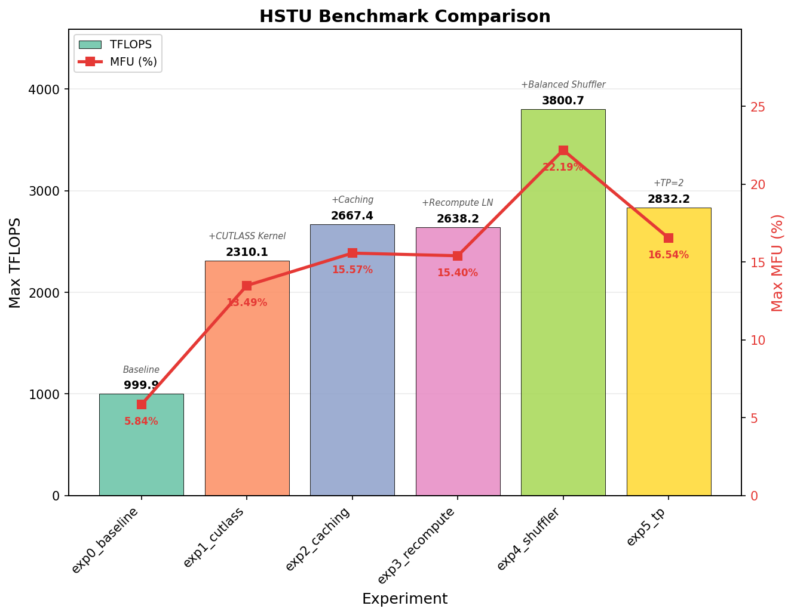

# HSTU End-to-End Training Performance Benchmark

This document describes the HSTU end-to-end training benchmark: a set of **progressive experiments** that incrementally enable optimizations to quantify each one's contribution to training throughput (MFU).

## 1. Background

### Embedding in Large-Scale Recommendation

Production recommendation models use massive embedding tables (tens of millions to billions of rows). A common deployment pattern:

- **CPU (host memory)**: stores the full embedding table — capacity is virtually unlimited.
- **GPU (device memory)**: acts as a **hot-embedding cache** — only frequently accessed rows reside on GPU for low-latency lookup.

DynamicEmb implements this two-tier architecture with automatic LRU/LFU eviction, admission control, and async prefetching.

### Optimization Space

Each experiment below adds **one** optimization on top of the previous, so the speedup is cumulative:

| # | Optimization | What It Does |
|---|-------------|-------------|
| 0 | Baseline | Triton attention, DynamicEmb without GPU cache, no recompute, no shuffler, DP-only |
| 1 | **CUTLASS Attention** | Replace Triton attention with a hand-tuned CUTLASS kernel optimized for HSTU's causal+context mask. Better register allocation and H100 utilization. |
| 2 | **DynamicEmb Caching** | Enable the GPU cache tier (10% of table rows on GPU). Hot embeddings served from HBM; cold embeddings fetched from host memory on cache miss. |
| 3 | **Selective Recompute** | Recompute LayerNorm activations during backward instead of storing them. Trades a small amount of compute for significant activation memory savings. |
| 4 | **Workload-Balanced Shuffler** | Redistribute variable-length sequences across GPUs so that each GPU's total attention FLOPs are balanced. Eliminates GPU idle time caused by HSTU's O(n²) attention on skewed sequence lengths. |
| 5 | **Tensor Parallel (TP=2)** | Split HSTU's UVQK projections and HSTU attention across 2 GPUs within a node. Halves per-GPU parameter and activation memory. |

### Benchmark Configuration

**Hardware**: H100-SXM5-80GB (single-node 8 GPU or multi-node)

**Model hyperparameters** (fixed across all experiments):

| Parameter | Value |
|-----------|-------|
| Hidden size | 1024 |
| Num HSTU layers | 8 |
| Num attention heads | 4 |
| Head dimension (kv_channels) | 256 |
| Item embedding dim | 128 |
| Contextual embedding dim | 128 |
| Prediction head | [512, 8] × 8 tasks |
| Optimizer | Adam (lr=1e-3) |

**Embedding tables**:

| Table | Rows | Dim | Type |
|-------|------|-----|------|
| item | 50M | 128 | DynamicEmb |
| action | 100 | 128 | Static (DP sharded) |
| user_id | 50M | 128 | DynamicEmb |
| user_age | 100 | 128 | DynamicEmb (no cache) |
| item_category_l1 | 50 | 128 | DynamicEmb (no cache) |

**Data distribution**:

| Parameter | Value |
|-----------|-------|
| Batch size per GPU | 32 |
| Max sequence length | 4096 |
| Sequence length distribution | Zipf (α=1.2), jagged |
| Training iterations | 1000 |
| Profiling window | iterations 150–200 |

Synthetic data with Zipf-distributed sequence lengths simulates the heavy-tailed user-history patterns seen in production.

---

## 2. Results

**Hardware**: 2× H100-SXM5-80GB nodes (16 GPUs total), measured on iteration 100–999 with 1 warmup skipped.

| Exp | Name | TFLOPS | MFU (%) | Speedup vs Baseline | Notes |
|-----|------|--------|---------|---------------------|-------|
| 0 | Baseline | 1000 | 5.84 | 1.00× | Triton attention, no cache, DP-only |
| 1 | +CUTLASS | 2310 | 13.49 | 2.31× | Attention kernel swap alone gives 2.3× |
| 2 | +Caching | 2667 | 15.57 | 2.67× | GPU embedding cache amortizes over time |
| 3 | +Recompute | 2638 | 15.40 | 2.64× | Saves memory with negligible throughput cost |
| 4 | **+Shuffler** | **3801** | **22.19** | **3.80×** | Largest single-step gain — eliminates attention skew |
| 5 | +TP=2 | 2832 | 16.54 | 2.83× | Trades communication for per-GPU memory savings |



### Key Takeaways

1. **CUTLASS attention is the foundation**: Replacing the Triton kernel with CUTLASS yields a 2.3× speedup — by far the most impactful single optimization, reflecting the attention-bound nature of HSTU.

2. **Workload-balanced shuffler delivers the highest MFU (22.2%)**: Zipf-distributed sequence lengths cause severe load imbalance with O(n²) attention. Redistributing sequences to equalize per-GPU FLOPs eliminates idle time and adds another 1.44× on top of CUTLASS+Caching+Recompute.

3. **Caching and recompute are memory-oriented**: DynamicEmb caching improves throughput from 13.49% to 15.57% MFU by reducing embedding lookup latency. Selective recompute saves memory with negligible throughput cost (15.40% MFU).

4. **Tensor Parallel introduces communication overhead**: TP=2 reduces per-GPU weight memory by half but adds AllReduce synchronization after each HSTU layer. The net effect is 16.54% MFU — better than baseline but lower than shuffler alone, suggesting TP is most beneficial when model size exceeds single-GPU memory capacity.

---

## 3. Reproducing the Benchmark

### Prerequisites

- Docker image built from `docker/Dockerfile`, or an equivalent environment with HSTU kernels and DynamicEmb compiled.
- All commands below assume **working directory** = `recsys-examples/examples/hstu`.

```bash
cd recsys-examples/examples/hstu
```

### Experiment definitions

Experiments are listed in `training/benchmark/experiments.txt`:

```
exp0_baseline,
exp1_cutlass,--kernel_backend cutlass
exp2_caching,--kernel_backend cutlass --caching
exp3_recompute,--kernel_backend cutlass --caching --recompute_layernorm
exp4_shuffler,--kernel_backend cutlass --caching --recompute_layernorm --balanced_shuffler
exp5_tp,--kernel_backend cutlass --caching --recompute_layernorm --balanced_shuffler --tp_size 2
```

Each line is `exp_name,options_for_generate_gin_config.py`. The script `generate_gin_config.py` produces a complete gin config file from these flags.

### Debug environment variables

| Variable | Default | Description |
|----------|---------|-------------|
| `MEM_DEBUG` | `0` | Log GPU physical memory (including NCCL buffers) after each optimizer step on all ranks |
| `CUDA_MEM_WATCHDOG` | `0` | Auto-call `torch.cuda.empty_cache()` when caching allocator fragmentation exceeds threshold |
| `CACHE_DEBUG` | `0` | Log per-table, per-rank DynamicEmb cache hit/miss/hit_rate after each forward pass |

Set before launching training, e.g. `export CUDA_MEM_WATCHDOG=1` in the SLURM job script or shell.

### Option A: Single experiment (local)

```bash
# Run one experiment on 8 GPUs
./training/benchmark/scripts/run_single_experiment_local.sh exp1_cutlass \
    --kernel_backend cutlass --nproc=8

# Dry-run (prints generated config, does not train)
./training/benchmark/scripts/run_single_experiment_local.sh exp1_cutlass \
    --kernel_backend cutlass --dry-run
```

### Option B: All experiments (local)

```bash
# Run every experiment in experiments.txt sequentially
./training/benchmark/scripts/run_all_experiments_local.sh \
    --exp-file=training/benchmark/experiments.txt \
    --nproc=8

# With nsys profiling
./training/benchmark/scripts/run_all_experiments_local.sh \
    --exp-file=training/benchmark/experiments.txt \
    --nproc=8 --nsys
```

### Option C: SLURM cluster

```bash
# Submit all experiments as SLURM jobs
./training/benchmark/scripts/submit_all_experiments_slurm.sh \
    --exp-file=training/benchmark/experiments.txt \
    --nodes=2 --ranks-per-node=8 --nsys

# Sequential execution (each job waits for the previous)
./training/benchmark/scripts/submit_all_experiments_slurm.sh \
    --exp-file=training/benchmark/experiments.txt \
    --nodes=2 --ranks-per-node=8 --nsys --sequential

# Dry-run
./training/benchmark/scripts/submit_all_experiments_slurm.sh \
    --exp-file=training/benchmark/experiments.txt --dry-run
```

Key `submit_all_experiments_slurm.sh` options:

| Flag | Default | Description |
|------|---------|-------------|
| `--exp-file=FILE` | *(required)* | Experiment list |
| `--nodes=N` | 2 | SLURM nodes |
| `--ranks-per-node=N` | 8 | GPUs per node |
| `--nsys` | off | Enable nsys profiling |
| `--sequential` | parallel | Chain jobs with dependencies |
| `--container-image=IMG` | *(see script)* | Override container image |
| `--partition=NAME` | batch | SLURM partition |
| `--time=HH:MM:SS` | 04:00:00 | Wall-time limit |
| `--wait-and-analyze` | off | Poll jobs and auto-run analysis |
| `--dry-run` | off | Print commands only |

### Running a subset

Create a custom experiment file:

```bash
cat > quick_test.txt << 'EOF'
exp0_baseline,
exp4_shuffler,--kernel_backend cutlass --caching --recompute_layernorm --balanced_shuffler
EOF

./training/benchmark/scripts/run_all_experiments_local.sh --exp-file=quick_test.txt --nproc=8
```

### Output directory structure

```
training/benchmark/results/
└── {batch_timestamp}/
    ├── exp0_baseline/
    │   ├── exp0_baseline_{timestamp}.gin     # generated config
    │   ├── exp0_baseline_{timestamp}.log     # training log
    │   └── exp0_baseline_*.nsys-rep          # nsys profiles (if --nsys)
    ├── exp1_cutlass/
    │   └── ...
    ├── summary.txt                           # batch summary
    └── comparison.png                         # TFLOPS + MFU comparison chart
```

### Analyzing results

```bash
# Parse MFU from training logs
python training/benchmark/scripts/analyze_results.py \
    training/benchmark/results/{batch_timestamp}/

# Nsight Systems CLI stats
nsys stats training/benchmark/results/{batch_timestamp}/exp0_baseline/*.nsys-rep
```
