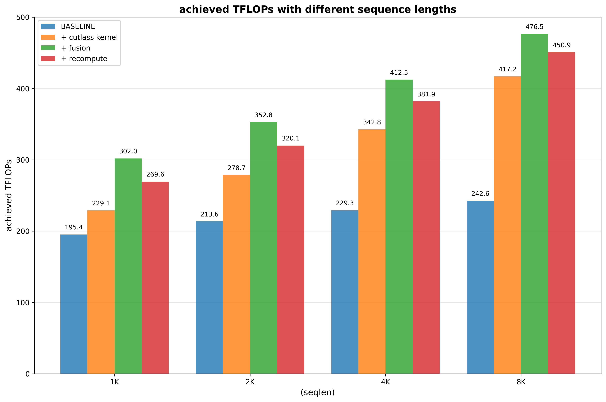
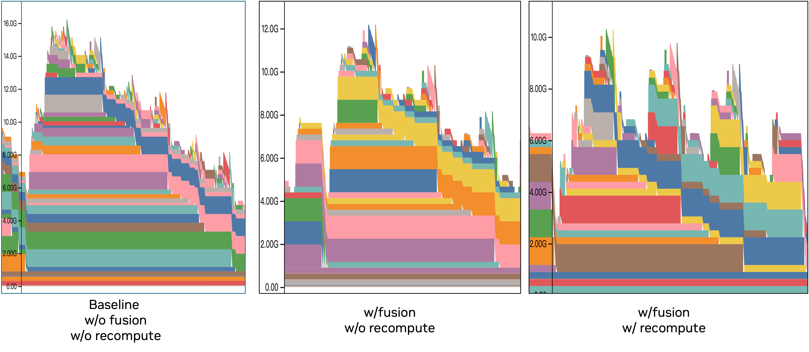

# HSTU Training Benchmark

## Benchmarks

### End-to-End Training Performance

Progressive benchmark measuring end-to-end MFU as optimizations are incrementally enabled (CUTLASS attention, DynamicEmb caching, selective recompute, workload-balanced shuffler, tensor parallel).

**[E2E Benchmark Documentation](./E2E_BENCHMARK.md)**

#### Results (2× H100-SXM5-80GB nodes, 16 GPUs)

| Exp | Name | MFU (%) | Speedup |
|-----|------|---------|---------|
| 0 | Baseline (Triton, DP-only) | 5.84 | 1.00× |
| 1 | +CUTLASS Attention | 13.49 | 2.31× |
| 2 | +DynamicEmb Caching | 15.57 | 2.67× |
| 3 | +Selective Recompute | 15.40 | 2.64× |
| 4 | **+Workload-Balanced Shuffler** | **22.19** | **3.80×** |
| 5 | +Tensor Parallel (TP=2) | 16.54 | 2.83× |

CUTLASS attention (2.3×) and workload-balanced shuffler (3.8×) are the two largest contributors. See the [full benchmark document](./E2E_BENCHMARK.md) for analysis.

### HSTU CUTLASS Attention MFU Heatmap

Standalone benchmark for the **CUTLASS-based HSTU attention kernel**. Sweeps batch sizes and sequence lengths on non-jagged (full-length) inputs and outputs TFLOPS/MFU heatmaps as PNG files.

```bash
cd recsys-examples/examples/hstu
python ./training/benchmark/scripts/benchmark_hstu_attn_mfu.py \
    --gin-config-file training/configs/benchmark_ranking.gin \
    --batch-sizes 4 8 16 32 64 \
    --seqlens 512 1024 2048 4096
```

#### Results (single H100-SXM5-80GB)

<p align="center"></p>

The CUTLASS attention kernel achieves peak MFU at large batch × seqlen products, where the GPU compute units are fully saturated. OOM (grey cells) occurs at the largest configurations.

### HSTU Layer Benchmark

Single HSTU layer micro-benchmark covering attention kernels, kernel fusions, and selective recompute.

The baseline is [Meta's open source HSTU implementation](https://github.com/meta-recsys/generative-recommenders/tree/bb389f9539b054e7268528efcd35457a6ad52439): Triton attention, no kernel fusions, no recompute.

Key arguments:

| Argument | Values | Description |
|----------|--------|-------------|
| `--kernel-backend` | `triton` / `cutlass` | Attention backend |
| `--fuse-norm-mul-dropout` | `True` / `False` | LayerNorm + Mul + Dropout fusion |
| `--recompute-input-silu` | `True` / `False` | SiLU activation recompute |
| `--recompute-input-layernorm` | `True` / `False` | LayerNorm activation recompute |

```bash
cd recsys-examples/examples/hstu

# Single run (baseline, seqlen=1K)
python ./training/benchmark/scripts/hstu_layer_benchmark.py run \
    --iters 100 --warmup-iters 50 \
    --layer-type native --kernel-backend triton \
    --dim-per-head 256 --num-heads 4 --num-layers 1 \
    --dtype bfloat16 --max-seqlen 1024 --full-sequence True --batchsize 32

# Sweep across configurations
bash ./training/benchmark/scripts/run_hstu_layer_benchmark.sh <num_layers>
```

Each run also produces a memory snapshot file. Visualize it with [PyTorch memory tools](https://docs.pytorch.org/docs/stable/torch_cuda_memory.html).

#### Results (single H100-SXM5-80GB)

Sequence lengths 1K–8K, batchsize=32, dim_per_head=256, num_heads=4, embedding_dim=1024.

**Throughput** (columns are incrementally applied):



**Peak memory** (3 HSTU layers, seqlen=4K):



### Memory Estimation

CPU-only script that estimates parameter, activation, and optimizer memory. Supports two modes:

```bash
# From gin config (batch_size, max_seq_len, etc. are read from the config)
python ./training/benchmark/scripts/estimate_memory.py \
    --gin_config training/benchmark/gin_configs/benchmark_exp0_baseline.gin

# From command-line arguments (no gin file needed)
python ./training/benchmark/scripts/estimate_memory.py \
    --batch_size 32 --max_seq_len 4096 --hidden_size 1024 --num_layers 8
```
