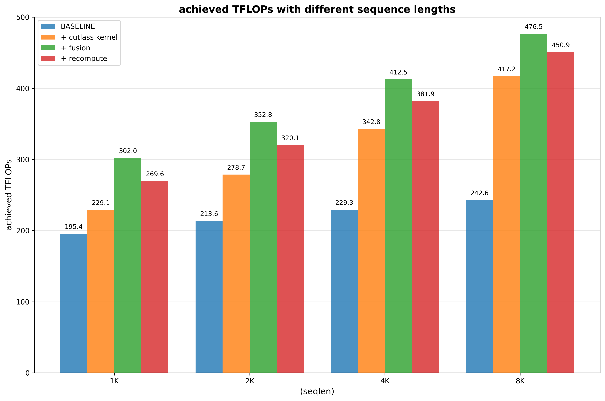

# HSTU layer benchmark

In hstu example, we have provided a set of performance optimization guidelines for single HSTU layer, including
1. Fast and memory-efficient hstu attention integration.
2. Kernel fusions: layer norm + multiplication + dropout 
3. Seletive forward recompute.

You can run script `run_hstu_benchmark.sh` to see the performance over the base implementation. The baseline is from [Meta's open source HSTU implementation](https://github.com/meta-recsys/generative-recommenders/tree/bb389f9539b054e7268528efcd35457a6ad52439), which features in:

1. Triton-based HSTU attention kernels with the remaining operations using PyTorch ops.
2. No kernel fusions.
3. No recompute.

## How to run

The test entry is `python ./benchmark/hstu_layer_benchmark.py run`, you can type `python ./benchmark/hstu_layer_benchmark.py run --help` to get the input arguments. 4 important arguments are :

1. --kernel-backend: select the hstu mha backend. Could be `triton` or `cutlass`.
2. --fuse-norm-mul-dropout: knob of  `layer norm + multiplication + dropout ` fusion. Could be `False` or `True`
3. --recompute-input-silu: knob of silu recompute. Could be `False` or `True`
4. --recompute-input-layernorm: knob of input layer norm recompute. Could be `False` or `True`

Our baseline cmd example (1K): 

```bash
python ./benchmark/hstu_layer_benchmark.py run \
  --iters 100 \
  --warmup-iters 50 \
  --layer-type native \
  --kernel-backend triton \
  --dim-per-head 256 \
  --num-heads 4 \
  --num-layers 1 \
  --dtype bfloat16 \
  --max-seqlen 1024 \
  --full-sequence True \
  --batchsize 32 
```

You can also run a set of arguments with run.sh:

```bash
bash run_hstu_layer_benchmark.sh <num_layers>
```

After one run is done, a memory snapshot file in current working directory is generated, you can trace the memory usage with the file. Please refer to [PyTorch docs](https://docs.pytorch.org/docs/stable/torch_cuda_memory.html) on how to visualize the memory trace.

## Benchmark results

We cover sequence from 1k~8k, other hyper-params are as followed:
| Item          | Value |
| ------------- | ----- |
| Batchsize     | 32    |
| dim per head  | 256   |
| num_heads     | 4     |
| embedding dim | 1024  |

All results are conducted on single H100-SXM5-80G

### Throughput



The columns other than the first column are incrementally tested based on the previous column.

### Peak memory

We trace the peak memory with the help of torch memory snapshot. To better identify the boundary forward and backward process, we have run 3 HSTU layers.
Below are the memory usage for seqlen=4K:


