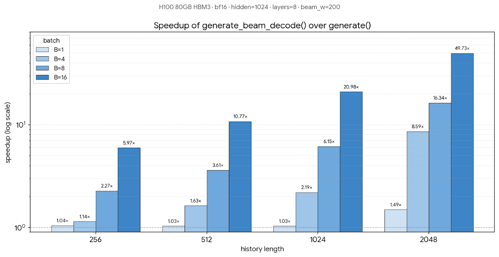

# Benchmark: `generate()` vs `generate_beam_decode()`

**Scope: end-to-end SID-GR generation latency.** Both timed paths run
the full transformer stack (8 layers × { attention + MLP + LayerNorm })
plus the LM head and beam-search bookkeeping — not just the attention
kernel. The `beam_decode_attn` kernel itself (correctness sweep,
per-call kernel latency) lives in the upstream repo
`gitlab-master.nvidia.com:cjerry/gr-decode_atten` (`tests/test_fwd.py`,
`tests/benchmark.py`); we vendor a snapshot at
`corelib/gr_decode_atten/`. The numbers below are the wallclock a real
inference caller sees, including all Python orchestration, embedding
lookup, and per-step KJT overhead.

Hardware: **NVIDIA H100 80GB HBM3 (SXM)**. Container: recsys-examples
Docker (bf16).

## What the two paths do

- **`generate()`** (baseline): at every hierarchy step, re-runs the
  full transformer over `[history + already-generated SIDs]`. The
  effective batch grows to `B × beam_width` after the first step;
  attention re-attends over the full sequence each step (O(seqlen²)
  per layer).
- **`generate_beam_decode()`** (optimized): one prefill over
  `[history + BOS]` populates a per-layer context KV cache, then
  `num_hierarchies − 1` decode steps each process only `beam_width`
  new tokens through the transformer, using the `beam_decode_attn`
  kernel to reuse the context KV cache and track per-beam ancestry via
  `topk_indices`.

The savings come from (a) MLP / projections only run on `beam_width`
new tokens per step instead of on the full prefix × effective batch,
and (b) attention complexity drops from O(seqlen²) to O(seqlen × W).

## Speedup

Fixed across the grid: `hidden=1024`, `num_heads=8`, `kv_channels=128`
(head_dim), `num_layers=8`, `num_hierarchies=4`, `codebook_size=256`,
`beam_width=200`, `bf16`, `use_jagged_kv=True` (the default;
discussed below). Median of 20 iterations after 5 warmup;
`cuda.synchronize()` before/after each iteration. All 16 configs PASS
top-K beam set overlap ≥ 70% between the two paths.

<p align="center">
  
</p>

`generate_beam_decode()` over `generate()` speedup, log scale. The
bottom-right (`B=16, hist=2048`) hits ~50× e2e; the top-left
(`B=1, hist≤1024`) is essentially flat (overhead-bound). For context:
at `B=16 hist=2048`, `generate()` takes ~4.0 s of wallclock while
`generate_beam_decode()` takes ~80 ms.

## Summary

Speedup grows monotonically along both dimensions. The bottom-right
corner (`B=16, hist=2048, beam_w=200`) is the realistic offline
candidate-generation regime: `generate()` takes **~4.0 s**,
`generate_beam_decode()` takes **~80 ms** — a ~50× e2e wallclock cut
that turns "unusable for online retrieval" into "usable as part of a
serving pipeline."

The top-left corner (`B=1, hist≤1024, beam_w=200`) is essentially flat
(~1.03×). At single-user scale the per-step Python orchestration (KJT
construction, embedding lookup, layer-stack launch overhead) dominates
wallclock, so saving the prefix recomputation work has nowhere to
land. The optimization is targeted at batched offline / warm-pool
inference, not single-request online serving.

## How to reproduce

```bash
cd examples/sid_gr
torchrun --nproc_per_node 1 benchmark/benchmark_beam_decode.py \
  --sweep --use_jagged_kv \
  --batch_size 16 --num_hierarchies 4 --num_layers 8 \
  --hidden_size 1024 --num_heads 8 --kv_channels 128 \
  --sweep_hist 256,512,1024,2048 \
  --sweep_beam 200 --sweep_dtype bf16
```

Vary `--batch_size` to fill in the other rows of the grid. The
Dockerfile adds `corelib/gr_decode_atten/` to `PYTHONPATH`, so no
extra setup is needed inside the container.

## Jagged-native context K/V (`use_jagged_kv=True`, default)

`generate_beam_decode` exposes a `use_jagged_kv` flag that controls
how the prefill K/V is fed into the kernel:

- **`use_jagged_kv=True`** (default): pack history as a flattened
  `[total_tokens, H, D]` stream and call FA's `flash_attn_varlen_func`
  with `causal=True` + `cu_seqlens_k`. No padding compute.
- **`use_jagged_kv=False`**: pad history to `[B, Sk_max, H, D]` and
  call FA's `flash_attn_func` with `causal=True` + `seqused_k` to
  mask the pad positions.

Both paths share the same standard-causal FA fast path internally, so
the only difference at the wallclock level is whether the padding
compute is done (dense) or skipped (jagged). Measured at
`B=16, beam_w=200, bf16`:

| hist | dense (ms) | jagged (ms) | jagged / dense |
|---:|---:|---:|---:|
|  256 |  27.1 | 23.3 | **1.17×** |
| 1024 |  59.5 | 41.6 | **1.43×** |
| 2048 | 118.1 | 80.1 | **1.48×** |

Jagged is 17 - 48 % faster across the range; the gap widens with
history length because padding compute is proportional to
`B × (Sk_max − seq_len[b])`.

At `B=1` the two paths are equivalent (no inter-sample padding to
skip); both are bounded by per-step orchestration overhead.

## Correctness verification

Three layers, weakest to strongest:

1. **Kernel reference oracle** (upstream `cjerry/gr-decode_atten`,
   `tests/test_fwd.py` — 14 quick cases via `make tt`, 1200
   parametrized cases via `make vt`): per-call kernel output compared
   against a fp32 PyTorch reference. This is the mathematical
   equivalence check for the attention kernel itself.
2. **Mask isolation unit tests** (`TestBeamIsolationMask` in
   `tests/test_beam_decode_generate.py`): direct geometry check on
   `padded_target_aware_causal_mask`.
3. **End-to-end regression guard** (this benchmark + the
   `test_generate_vs_generate_beam_decode_regression_guard` unit
   test): asserts top-K beam SID set overlap ≥ 70% between the two
   paths. bf16 noise plus beam-search topk tie-breaking make
   bit-exact equivalence impossible; the overlap metric stays bounded
   in `[0, 1]` regardless of scale, so the threshold remains
   meaningful as workloads grow.

## Known issues

- **Split-KV + `seqused_k`** hangs the K1 context-attention launch on
  SM90 (observed once during kernel development). The vendored kernel
  forces `num_splits=1` when `seqused_k` is set; the workaround costs
  a few percent on small-batch shapes but avoids the hang.
- **`use_jagged_kv=False`** (dense + `seqused_k`) is kept as an
  alternative for callers that already produce padded inputs and want
  to avoid the explicit `cu_seqlens` plumbing. It is 17 - 48 % slower
  than the default `True` path at `B=16` but otherwise identical in
  semantics.
